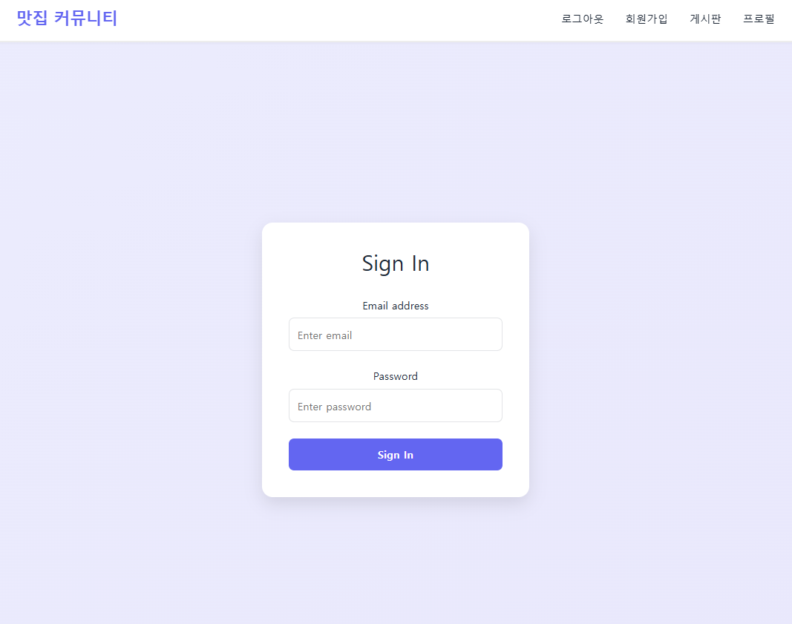
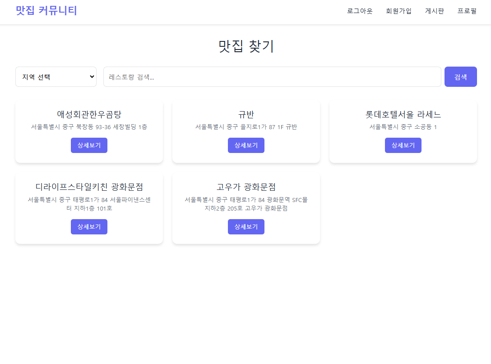
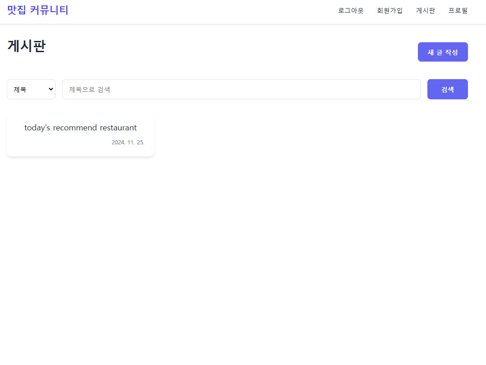
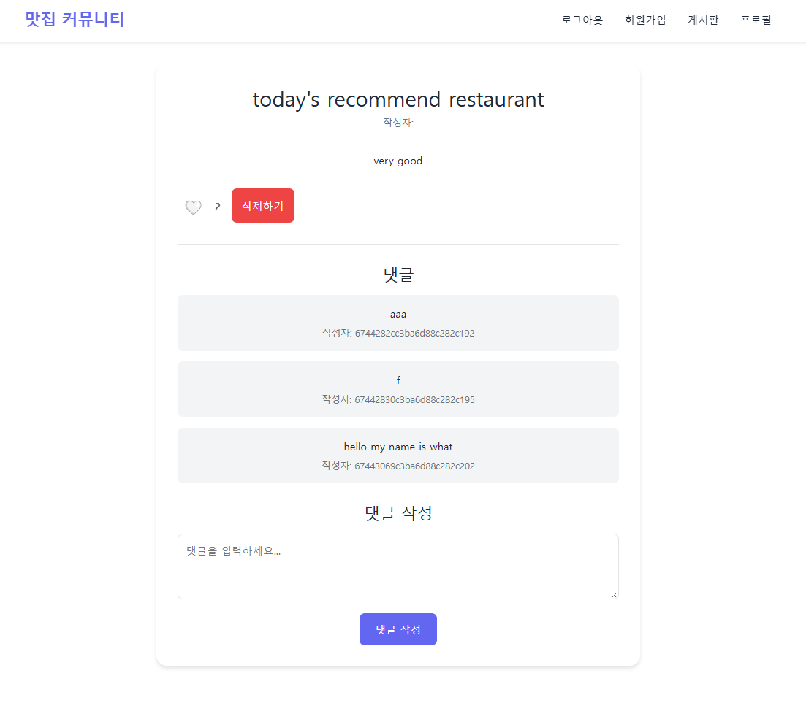
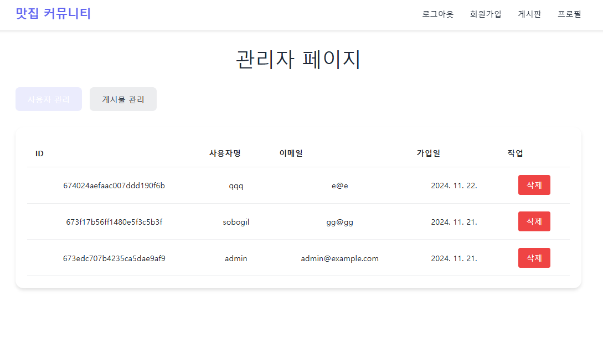

# 맛집 커뮤니티 웹 애플리케이션

## 프로젝트 소개
이 프로젝트는 Node.js 백엔드와 React 프론트엔드를 사용하여 개발된 맛집 커뮤니티 웹 애플리케이션입니다. 사용자들은 맛집 정보를 공유하고, 게시글을 작성하며, 서로 소통할 수 있는 플랫폼을 제공합니다.

## 기술 스택
### Backend
- Node.js
- Express.js
- MongoDB (Mongoose)
- JWT Authentication
- bcrypt

### Frontend
- React
- React Router DOM
- Styled Components
- Axios

## 주요 기능

### 1. 사용자 인증
- 회원가입
- 로그인/로그아웃
- JWT 기반 인증
- 사용자 프로필 관리

### 2. 게시판 기능
- 게시글 CRUD 작업
- 댓글 시스템
- 좋아요 기능
- 게시글 검색 (제목, 작성자)

### 3. 맛집 정보
- 네이버 API 연동
- 지역별 맛집 검색

### 4. 관리자 기능
- 사용자 관리
- 게시글 관리

## API 엔드포인트

### 사용자 관련
POST /api/users/register - 회원가입  
POST /api/users/login - 로그인  
GET /api/users/profile - 프로필 조회  
PUT /api/users/profile - 프로필 수정  

### 게시글 관련
GET /api/posts - 게시글 목록 조회  
POST /api/posts - 게시글 작성  
GET /api/posts/:postId - 특정 게시글 조회  
PUT /api/posts/:postId - 게시글 수정  
DELETE /api/posts/:postId - 게시글 삭제  

### 댓글 관련
POST /api/comments/:postId - 댓글 작성  
GET /api/comments/:postId - 댓글 목록 조회  
DELETE /api/comments/:commentId - 댓글 삭제  

### 좋아요 관련
POST /api/likes - 좋아요 추가  
GET /api/likes/:postId - 좋아요 수 조회  
DELETE /api/likes/:postId - 좋아요 취소  

### 관리자 관련
GET /api/admin/users - 전체 사용자 조회  
GET /api/admin/posts - 전체 게시글 조회  
DELETE /api/admin/users/:userId - 사용자 삭제  
DELETE /api/admin/posts/:postId - 게시글 삭제  

## 프로젝트 구조
```
project/
├── Back/
│   └── node.js/
│       ├── controllers/
│       ├── models/
│       ├── routes/
│       ├── middleware/
│       └── app.js
└── Front/
    └── front-react/
        ├── public/
        └── src/
            ├── components/
            ├── services/
            ├── context/
            └── styles/
```

## 설치 및 실행 방법

1. 저장소 클론
```bash
git clone [repository-url]
```

2. 백엔드 설정
```bash
cd Back/node.js
npm install
```

3. 프론트엔드 설정
```bash
cd Front/front-react
npm install
```

4. 환경 변수 설정
- Back/node.js/.env 파일 생성
```
MONGODB_URI=your_mongodb_uri
JWT_SECRET=your_jwt_secret
NAVER_CLIENT_ID=your_naver_client_id
NAVER_CLIENT_SECRET=your_naver_client_secret
```

5. 서버 실행
```bash
# 백엔드 실행 (Back/node.js 디렉토리에서)
node app.js

# 프론트엔드 실행 (Front/front-react 디렉토리에서)
npm start
```

## 웹 페이지 

### 로그인 페이지


### 메인 페이지


### 게시판 목록


### 게시글 상세


### 관리자 페이지



## 라이선스
This project is licensed under the MIT License - see the LICENSE file for details
